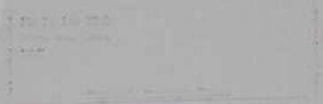

## Product Specifications & Lifecycle Report

This document is generated apecifically to test the Pandoc extraction pipelise. contains complex multi-lvel tables wt merged ells and oleddes – all structures that cause Pandoc to emit HTML table tags.

## 1. Inline Text Formatting

Bold red text. Italic text. Underlined text. Bold + Italie + Blue.

## 2. Nested Bullet & Numbered Lists

Alpha Product Line

Sub-category A

• Detail level — specifications here

Sub-category B

• Detail level — specifications here

• Beta Product Line

• Sub-category A

• Detail level— specifications here

• Sub-category B

Detail level — specifications here

Gamma Product Line

Sub-category A

Detail level — specifications here

• Sub-category B

## • Detail level— specifications here

## Numbered Steps

1. Gather all input DOCX files.

2. Run them through the Pandoc pipeline.

3. Review the generated Markdown output.

4. Verify with the QA team.

## 3. Simple Product Table

This is a standard table Pandoc should render as a GFM pipe table:

<table><tr><td rowspan=1 colspan=1>Prodas (D</td><td rowspan=1 colspan=1>Namne</td><td rowspan=1 colspan=1>Categury</td><td rowspan=1 colspan=1>Price (E)</td></tr><tr><td rowspan=1 colspan=1>P-001</td><td rowspan=1 colspan=1>Funeral Plan Gold</td><td rowspan=1 colspan=1>Insurance</td><td rowspan=5 colspan=1>£4,500£3,200£1,800£299</td></tr><tr><td rowspan=1 colspan=1>P-002</td><td rowspan=1 colspan=1>Funeral Plan</td><td rowspan=1 colspan=1>Insurance</td></tr><tr><td rowspan=1 colspan=1></td><td rowspan=1 colspan=1>Silver</td><td rowspan=1 colspan=1></td></tr><tr><td rowspan=1 colspan=1>P-003</td><td rowspan=1 colspan=1>Probate Service</td><td rowspan=1 colspan=1>Legal</td></tr><tr><td rowspan=1 colspan=1>P-004</td><td rowspan=1 colspan=1>Will Writing Kit</td><td rowspan=1 colspan=1>Legal</td></tr></table>

## 4. Complex Merged-Cell Table (triggers HTML output)

This table uses cell merging (colspan/rowspan). Pandoc cannot represent this in standard Markdown, so it will emit HTML <table> tags.

<table><tr><td rowspan=1 colspan=5>Pruutut Detalb                           Ciini Te my             Stutua</td></tr><tr><td rowspan=1 colspan=1>Code</td><td rowspan=1 colspan=1>Name</td><td rowspan=1 colspan=1>Q1 Revenue</td><td rowspan=1 colspan=1>Q2 Revenue</td><td rowspan=1 colspan=1>Lifecycle</td></tr><tr><td rowspan=1 colspan=1>P-001</td><td rowspan=1 colspan=1>Funeral Plan</td><td rowspan=1 colspan=1>£420,000</td><td rowspan=2 colspan=1>£380,000</td><td rowspan=2 colspan=1></td></tr><tr><td rowspan=1 colspan=1></td><td rowspan=1 colspan=1>Gold</td><td rowspan=1 colspan=1></td></tr><tr><td rowspan=1 colspan=1>P-002</td><td rowspan=1 colspan=1>Funeral Plan</td><td rowspan=1 colspan=1>£290,000</td><td rowspan=2 colspan=1>£310,000</td><td rowspan=2 colspan=1>Anla</td></tr><tr><td rowspan=1 colspan=1></td><td rowspan=1 colspan=1>Silver</td><td rowspan=1 colspan=1></td></tr><tr><td rowspan=1 colspan=1>P-003</td><td rowspan=1 colspan=1>Probate</td><td rowspan=1 colspan=1>£120,000</td><td rowspan=2 colspan=1>£145,000</td><td rowspan=2 colspan=1></td></tr><tr><td rowspan=1 colspan=1></td><td rowspan=1 colspan=1>Service</td><td rowspan=1 colspan=1></td></tr></table>

## 5. Table With Multi-Paragraph Cells

Cells with multiple paragraphs also force Pandoc into HTML mode because GFM pipe tables cannot contain newlines inside a cell.

<table><tr><td></td><td></td><td>Configured per router</td></tr><tr><td>Extraction Engine</td><td>Primary: Pandoc (gfm) Fallback: MarkItDown Legacy: Docling</td><td>Stored in SharePoint</td></tr><tr><td>Output Format</td><td>GitHub Flavoured Markdown (.md)</td><td></td></tr></table>

## 6. Important Notes

All documents processed by this pipeline are subject to the 3-stage lifecycle: Raw → Draft → Final. No document reaches downstream AI systems until it has been signed off by an authorised verifier.

## 7. Wide Multi-Column Data Table (forces HTML)

A table with 8+ narrow columns where the header row spans 2 levels also cannot be expressed in GFM — Pandoc will emit HTML.

<table><tr><td rowspan=3 colspan=4>Q1 Metrics</td><td rowspan=1 colspan=4>Q2 Metries</td></tr><tr><td rowspan=2 colspan=1></td><td rowspan=2 colspan=1></td><td rowspan=1 colspan=1></td><td rowspan=1 colspan=1></td><td rowspan=2 colspan=4>Apr         May        Jun         TotalQ2</td></tr><tr><td rowspan=1 colspan=1></td><td rowspan=1 colspan=1></td></tr><tr><td rowspan=1 colspan=1>120</td><td rowspan=1 colspan=1>135</td><td rowspan=1 colspan=1>142</td><td rowspan=1 colspan=1>397</td><td rowspan=1 colspan=1>150</td><td rowspan=1 colspan=1>160</td><td rowspan=1 colspan=1>175</td><td rowspan=1 colspan=1>485</td></tr><tr><td rowspan=1 colspan=1>200</td><td rowspan=1 colspan=1>210</td><td rowspan=1 colspan=1>195</td><td rowspan=1 colspan=1>605</td><td rowspan=1 colspan=1>220</td><td rowspan=1 colspan=1>230</td><td rowspan=1 colspan=1>215</td><td rowspan=1 colspan=1>665</td></tr><tr><td></td><td rowspan=2 colspan=1>90</td><td rowspan=2 colspan=1>85</td><td rowspan=2 colspan=1>255</td><td rowspan=2 colspan=1>100</td><td rowspan=2 colspan=1>110</td><td rowspan=2 colspan=1>95</td><td rowspan=2 colspan=1>305</td></tr><tr><td rowspan=1 colspan=1>80</td></tr></table>

# Word Template for Full Length Paper

1st Author 1st author's institute affiliation lephone number E-mail address

2nd Author 2nd author's institute affiliation lephone number E-mail addres

3rd author's institute affiliation E-mail

## Abstract

The abstraer is to be in fully-justified italicized text, at the top of the left-hand column as it is here, below the author information. Use the word "Abstract" as the title, in 12-point Times, boldface type. centered relative to the column, initially capitalized. The abstract is to be in 10- point, single-spaced type, and may be up to 3 in. (7.62 cm) long. Leave two blank lines after the abstract, then begin the main text. All manuscripts must be in English.

## I. Introduction

These guidelines include complete descriptions of the fonts. spacing, and related information for producing your proceedings manuscripts. Please follow them and if you have any questions, direct them to the production editor in charge of your proceedings at the IEEE Computer Society Press: Phone (714) 821-8380 or Fax (714) 761-1784.

## 2. Formatting Your Paper

All printed material, including text, illustrations, and charts. must be kept within a print area of 6-7/8 inches (17.5 cm) wide by 8-7/8 inches (22.54 cm) high. Do not write or print anything outside the print area. All text must be in a two-column format. Columns areto be 3- 1/4 inches (8.25 cm) wide, with a 5/16 inch (0.8 cm) space between them.

Text must be fully justified. A format sheet with the margins and placement guides is available in Word files as <format.doc>. It contains lines and boxes showing the margins and print areas. If you hold it and your printed page up to the light, you can easily check your margins to see if your print area fits within the space allowed.

## 3. Main Title

The main title (on the first page) should begin 1-3/8 inches (3.49 em) from the top edge of the page, centered, and in Times 14-point, boldface type. Capitalize the first letter of nouns, pronouns, verbs, adjectives, and adverbs;

do not capitalize articles, coordinate conjunctions, or prepositions (unless the title begins with such a word). Leave two blank lines afte

## 4. Author Name(s) and Affiliation(s)

Author names and affiliations are to be centered beneath the title and printed in Times 12-point, nonboldface type. Multiple authors may be shown in a twoor three-column format, with their affiliations below their respective names. Affiliations are centered below each author name, italicized. not bold. Include e-mail addresses if possible. Follow the author information by two blank lines before main text.

## 5. Second and Following Pages

The second and following pages should begin 1.0 inch (2.54 cm) from the top edge. On all pages, the bottom margin should be 1-1/8 inches (2.86 em) from the bottom edge of the page for 8.5 x 11-inch paper; for A4 paper, approximately 1-5/8 inches (4.13 cm) from the bottom edge of the page.

## 6. Type-style and Fonts

Wherever Times is specified, Times Roman, or New Times Roman may be used. If neither is available on your word processor, please use the font closest in appearance to Times that you have access to. Please avoid using bitmapped fonts if possible. True-Type 1 fonts are preferred.

## 7. Main Text

Type your main text in 10-point Times, single-spaced. Do not use double-spacing. All paragraphs should be indented 1pica (approximately 1/6- or 0.17-inch or 0.422 cm). Be sure your text is fully justified—that is. flush left and flush right. Please do not place any additional blank lines between paragraphs. You can use courier for source code.

## 7.1. Figure and Table Captions

Captions should be 9-point Times New Roman font. boldface. Callouts should be Times NewRoman, nonboldface. Initially capitalize only the first word of each figure caption and table title. Figures and tables must be zumbered separately. For example: "Figure I. Example figure.", "Table I. Table example.". Figure captions are to be below the figures (see Figure 1). Table titles are to be centered above the tables (see Table 1.

Table 1. Table example.
<table><tr><td>One Two Three</td></tr></table>

## 8. First-order Headings

For example, "1. Introduction", should be Times 12- point boldface, initially capitalized, flush lefl, with one blank line before, and one blank line after. Use a period (".") after the heading mumber, not a col

## 8.1. Second-order Headings

As in this heading. they should be Times 11-point boldface, initially capitalized, flush left, with one blank line before, and one afte

8.1.1. Third-order Headings. Third-order headings, as in this paragraph, are discouraged. However, if you must use them, use 10-point Times, boldface, initially capitalized, flush left. preceded by one blank line. followed by a period and your text on the same line.

## 9. Acknowledgements

This work was supported in part by a grant from the National Science Foundation

## 10.References

List and number all bibliographical references in 9. point Times, single-spaced, at the end of your paper: When referenced in the text. enclose the citation number in square brackets, for example [2-4]. [2, 5], and [1]

[1] Briand. L. C., Daly, L, and Wost, J, "A unified framework fow coupling measurement in ohjectoriented systems", /FEE Tronsactions on Sofware Engineering, 25, 1, Jamuary 1999. pp 91-121

[2] Matetic, J. L, Collard, M L.. and Marcus, A., "Soerce Code Files as Structured Documents", in Proceedings 1oth JEEE International Workshop on Program Comprehension (WPC02), Paris, France, June 27-29 2002, pp. 289-292.

[3] Marcus, A., Semaritie Driven Program Analyois, Kent State University, Kent, OH, USA, Doctoral Thesis, 2003

[4] Marcus, A. and Maletic, J. L, "Recorvering Docurnentationto-Source-Code Traceability Links using Latent Semantic Indexing", in Proceedings 25th IEEE/ACM International Conference on Sofhware Engineering (ICSE'O3), Portland, OR. May 3-10 2003, pp. 125-137

[5] Salton, G., Automatic Text Processing: The Transformation Analysis and Retrieval of Information by Computer, Addison-Wesley, 1989

# This is a 4-Column Test Document

This spanning header is placed in the first frame. Then the text flows into the columns.

## Block 1

Text block 1:Lorem ipsum dolor sit amet, consectetur adipiscing elit. Sed do eiusmod tempor incididunt ut labore et dolore magna aliqua. Ut enim ad minim veniam, quis nostrud exercitation ullamco laboris nisi ut aliquip ex ea commodo consequat. Duis aute irure dolor in reprehenderit in voluptate velit esse cillum dolore eu fugiat nulla pariatur.

## Block 2

Text block 2: Lorem ipsum dolor sit amet, consectetur adipiscing elit. Sed do eiusmod tempor incididunt ut labore et dolore magna aliqua. Ut enim ad minim veniam, quis nostrud exercitation ullamco laboris nisí ut aliquip ex ea commodo consequat. Duis aute irure dolor in reprehenderit in voluptate velit esse cillum dolore eu fugiat nulla pariatur.

## Block 3

Text block 3: Lorem ipsum dolor sit amet, consectetur adipiscing elit. Sed do eiusmod tempor incididunt ut labore et dolore magna aliqua. Ut enim ad minim veniam, quis nostrud exercitation ullamco laboris nisi ut aliquip ex ea commodo consequat. Duis aute irure dolor in reprehenderit in voluptate velit esse cillum dolore eu fugiat nulla pariatur.

## Block 4

Text block 4: Lorem ipsum dolor sit amet, consectetur adipiscing elit. Sed do eiusmod tempor incididunt ut labore et dolore magna aliqua. Ut enim ad minim veniam, quis nostrud exercitation ullamco laboris nisi ut aliquip ex ea commodo consequat. Duis aute irure dolor in reprehenderit in voluptate velit esse cillum dolore eu fugiat nulla pariatur.

## Block 5

Text block 5: Lorem ipsum dolor sit amet, consectetur adipiscing elit. Sed do eiusmod tempor incididunt ut labore et dolore magna aliqua. Ut enim ad minim veniam, quis nostrud exercitation ullamco laboris nisi ut aliquip ex ea commodo consequat. Duis aute irure dolor in reprehenderit in voluptate velit esse cillum dolore eu fugiat nulla pariatur.

## Block 6

Text block 6: Lorem ipsum dolor sit amet, consectetur adipiscing elit. Sed do eiusmod tempor incididunt ut labore et dolore magna aliqua. Ut enim ad minim veniam, quis nostrud exercitation ullamco laboris nisi ut aliquip ex ea commodo consequat. Duis aute irure dolor in reprehenderit in voluptate velit esse cillum dolore eu fugiat nulla pariatur.

## Block 7

Text block 7: Lorem ipsum dolor sit amet, consectetur adipiscing elit. Sed do eiusmod tempor incididunt ut labore et dolore magna aliqua. Ut enim ad minim veniam, quis nostrud exercitation ullamco laboris nisi ut aliquip ex ea commodo consequat. Duis aute irure dolor in reprehenderit in voluptate velit esse cillum dolore eu fugiat nulla pariatur.

## Block 8

Text block 8: Lorem ipsum dolor sit amet, consectetur adipiscing elit. Sed do eiusmod tempor incididunt ut labore et dolore magna aliqua. Ut enim ad minim veniam, quis nostrud exercitation ullamco laboris nisi ut aliquip ex ea commodo consequat. Duis aute irure dolor in reprehenderit in voluptate velit esse cillum dolore eu fugiat nulla pariatur.

## Block 9

Text block 9: Lorem ipsum dolor sit amet, consectetur adipiscing elit. Sed do eiusmod tempor incididunt ut labore et dolore magna aliqua. Ut enim ad minim veniam, quis nostrud exercitation ullamco laboris nisi ut aliquip ex ea commodo consequat. Duis aute irure dolor in reprehenderit in voluptate velit esse cillum dolore eu fugiat nulla pariatur.

## Block 10

Text block 10: Lorem ipsum dolor sit amet, consectetur adipiscing elit. Sed do eiusmod tempor incididunt ut labore et dolore magna aliqua. Ut enim ad minim veniam, quis nostrud exercitation ullamco laboris nisi ut aliquip ex ea commodo consequat. Duis aute irure dolor in reprehenderit in voluptate velit esse cillum dolore eu fugiat nulla pariatur.

## Block 11

Text block 11: Lorem ipsum dolor sit amet, consectetur adipiscing elit. Sed do eiusmod tempor incididunt ut labore et dolore magna aliqua. Ut enim ad minim veniam, quis nostrud exercitation ullamco laboris nisi ut aliquip ex ea commodo consequat Duis aute irure dolor in reprehenderit in

voluptate velit esse cillum dolore eu fugiat nulla pariatur

## Block 12

Text block 12: Lorem ipsum dolor sit amet. consectetur adipiscing elit. Sed do eiusmod tempor incididunt ut labore et dolore magna aliqua. Ut enim ad minim veniam, quis nostrud exercitation ullamco laboris nisi ut aliquip ex ea commodo consequat Duis aute irure dolor in reprehenderit in voluptate velit esse cillum dolore eu fugiat nulla pariatur.

voluptate velit esse cillum dolore eu fugiat nulla pa

## Block 13

Text block 13: Lorem ipsum dolor sit amet, consectetur adipiscing elit. Sed do eiusmod tempor incididunt ut labore et dolore magna aliqua. Ut enim ad minim veniam, quis nostrud exercitation ullamco laboris nisi ut aliquíp ex ea commodo consequat. Duis aute irure dolor in reprehenderit in voluptate velit esse cillum dolore eu fugiat nulla pariatur.

## Block 14

Text block 14: Lorem ipsum dolor sit amet, consectetur adipiscing elit. Sed do eiusmod tempor incididunt ut labore et dolore magna aliqua. Ut enim ad minim veniam, quis nostrud exercitation ullamco laboris nisi ut aliquip ex ea commodo consequat. Duis aute irure dolor in reprehenderit in

# Word Template for Full Length Paper

Ist Author tet author's institute affiation Telephone number E-mail address

2nd Author 2nd author's instit ite afliation ephone number E-mail address

## Abstract

The shetruct is ar he in fullejustfied ualicioed text af dhe top of she lefi hai erunn as it is here below the shar ahrmatie Use the word "Ahatact" as the tile in 12 puint Times. boldface ppe. ccatered relative to the initially cupmatced Dhe abstraer is to be is 10 t single spaced type snd may he ap to 5 in ( 02 long. Lenve too Mlank ines afier the abstract. then gin she matt test. All mcomserigptr mer he in Erglich

## I. Introduction

These guidelmes inciude complete deseriptions of the fones. sqocing. aod related mformation for producing your proceodings manoscripts Please follow them and if yos have any questons, diret tem to the prodoction editar in chage of your prceedings at the E Computer Society Pres: Phone (714) 821-8380 or Fax (714) 761-1784

## 2. Formatting Your Paper

Al peinted materuil. inciuding text, ilhstrations, and charts must be kepe within a print arca of 6-7/8 inches (17.5 ) wide by 8-7/ inches (2254 cm) high Do n write or print anything outside the print area. All text must be in a two-colemn format. Columns are to be 3- 4 mche (8.25 em) wide, with a 5/16 inch (0.8 em) ipoce besween thein.

Teat mnt be fully justified A format sheet with the margis and placenent guides is available in Woed files as -fomut.adoc>. It contains lines and boxes shoswing the margins and print areas. If you hold à and your peinted poge up to the light. you can cmsily check ymw margins to set if yout primt area fits within the spuce allowed

## 3. Main Title

The mnin title (on the first page) should begin 1-38 inches (.49 em) from the top edge of the page, centered. and in Times 14-point, boldface type. Captalize the first ner of pouns. pronouns, veris, aíjectives, and adverbs;

3rd Author   
Grd author's institute: aflliation   
Telephone number   
E-mail address

do not capitalize articles, coordinate conjonctions, or prepositions (unless the title begits with such a word). Leave two blank lines after the tile

## 4. Author Name(s) and Affiliation(s)

Author names and affiliations are to be centered bencath the title and prined in Times 12-point. nonholdface type. Multiple muthors may be shown in a twoor three-column format, with their afliliations below their respective names. Afliliations are centered below each author tame, italicized. not bold. Inchude email middresses if pousible. Fallow the mathor information by two blank lines before main text.

## 5. Second and Following Pages

The seoond and following pages should begin 1.0 inch (2.54 cm) from the top edge. On all pages. the bottom margin should be 1-1/8 inches (2.80 cm) from the bottenm edge of the page for 8.5 x 11-inch paper: for A4 paper. approximately 1-5/8 inches (4.13 cm) from the bonom edge of the page.

## 6. Type-style and Fonts

Wherever Times is specified. Times Romant, or New Tunes Roman may be used. If neither is available on your word processor, plerse use thie font closest in appearance to Times thuat you have access to. Please avoid using bitmapped fonts if possible. True-Type 1 fonts are preferred.

## 7. Main Text

Type your main text in 10-point Times, singlespaced. De not ase doubie-spacing. All paragraphs should be indented 1 pica (approximately 1/6- or 0.17-inch or 0.422 cm). Be sure your text is fully justified-that is, flush left and flush right. Please do not place any additional blank lines berween paragraphs. You can use courier for source code.

## 7.1. Figure and Table Captions

Captions should be 9-point Times New Roman font. boldface. Callouts should be Times New Roman, nonbolidface. Initially capitalize only the first word of each figure caption and table title. Figures and tables must be mumbered wyarately. For example: "Figure I. Example figure.", "Table 1. Table example.". Figure captions are to be below the figunes (see Figure 11. Table titles are to be centered above the tables (see Table 1.

## Table 1. Table example.

One Two Three

## 8. First-order Headings

For example. -1. Introduction". should be Times 12- point boldface, initially capitalized, flush left. with one blank line betore, and one blank line afier. Use a period ("") after the heading number, not a colon.

## 8.1. Second-order Headings

As in this heading. they should be Times 11-point boldface, initiatly capitalized, flush left, with one blank line before, and one after.

8.1.1. Third-order Headings. Thind-order headings. as in this parngraph, are discouraged. However, if you must ue them. ue 10-point Times. holdface, iitially capitalized. flush lett, preceded by one blank line, followed hy a period and your text on the same line.

## 9. Acknowledgements

This work was supported in part by a geant from the Natioral Science Foundation

## 10. References

List and mumber all bibliographical references in 9. point Times, single-spaced. at the end of your paper. When referenced in the text, enclose the citation number in square brackets, for example [2–4]. [2. 5], und [1] [] Briand. L. C\_ Daly. J., and Wost, J\_"A unified frameswork for coupling mcasurement in objectoriested system", zEz'a Yruruoctions on Sofhsae Engineering. 25, 1. Jamuary 1999, pp 91-121

[2] Maletic, 1. L, Colland. M. L... and Marcun, A. "Souror Code Files as Straetuted Documens", in Proceedings füth lEEE Interruational Workshop on Program Compeehertion r/WPC02). Piris, France. June 27-29 200z. pp. 289-292

[3] Marcus, A.Semuntic Driven Progrom Amalysis, Kent State University, Kent, OH, USA, Doctoral Thesis, 2003

[4] Marcus, A. and Maletic, J. I. "Recoverimg Documemtationto-Source-Code Tacenhility Links uning Latent Semantie Indexing". in Pruceedings 25th 1EEE ACM Internatinmal Cerderence on Sufiware Ergineering (ICSEOD), Portland, CR. May 3-10 2003. pp. 125-137.

[5] Salton. G.. Autiomatie Teat Prcessing The Trarsformatior. Anolysts and Retrieval of Information by Computer. Addison-Wenley, 1989