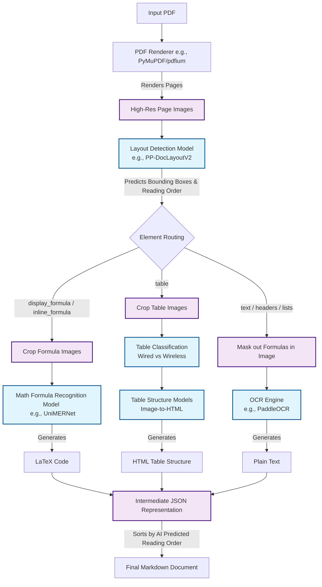

# PDF Extraction Pipeline Architecture

## 1. Pipeline Flow Diagram

This diagram illustrates how a PDF document traverses the vision-first AI pipeline, breaking down exactly how layouts, formulas, and tables are isolated and processed.

---

## 2. Model Licensing and Memory Consumption

### Are the models free?
**Yes.** The models used in this type of architecture (like MinerU) are generally open-source and free for commercial use. 
- **Layout Models** (e.g., RT-DETR, LayoutLM variants)
- **OCR** (e.g., PaddleOCR)
- **Formula Recognition** (e.g., UniMERNet)
These typically carry permissive licenses like Apache 2.0 or MIT. 

### How much memory does it consume?
Because this pipeline runs multiple deep learning vision models simultaneously, it is **very resource-intensive**.
- **GPU VRAM**: A production setup ideally requires **16GB to 24GB of VRAM** (e.g., NVIDIA RTX 3090 / 4090 or A10G/A100 cloud GPUs). While it *can* run on 8GB GPUs by unloading and reloading models sequentially, this causes massive bottlenecks and drastically slows down processing.
- **System RAM**: At least **16GB to 32GB** of standard RAM is needed to handle high-resolution PDF image rendering and matrix manipulations in memory.

---

## 3. Production Deployment: Local vs. Cloud

Should you run these models yourself, or use cloud APIs? It depends heavily on your team's capability and your privacy requirements.

### Option A: Self-Hosting (Local or Cloud VMs)
You rent GPU instances (like AWS EC2 `g5.xlarge`) and run this open-source pipeline yourself.
* **Pros**: Complete data privacy (no documents sent to third-party APIs), absolute control over the code, and no per-page API costs.
* **Cons**: Managing GPU infrastructure is expensive and complex. You have to handle auto-scaling, CUDA driver issues, and containerizing heavy AI models.

### Option B: Managed Cloud Alternatives
Instead of hosting open-source models, you use proprietary cloud endpoints.
* **Alternatives**: **AWS Textract**, **Google Cloud Document AI**, or **Azure Document Intelligence**.
* **Pros**: Zero infrastructure to maintain. Infinite scalability out of the box. Highly accurate state-of-the-art proprietary models.
* **Cons**: You pay per page (which can get expensive at massive scale), and you must send your documents to a cloud provider.

**Recommendation**: Unless you have strict data compliance requirements (like HIPAA/ITAR) or process millions of pages a month, **Managed Cloud APIs** are generally the safer, more stable choice for production.

---

## 4. Why This Architecture? (Vision-First vs. Traditional)

To understand why this architecture is built this way, you have to understand how older systems worked.

### The Old Way: Rule-Based & PDF Metadata (e.g., PyPDF, pdfplumber)
Traditional parsers read the internal vector drawing instructions embedded inside the PDF file. They look at the X/Y coordinates of text characters and try to use heuristics (rules) to guess what is a paragraph and what is a table.
* **The Flaw**: It fails completely on scanned documents. It destroys multi-column layouts because it just reads text left-to-right regardless of visual boundaries. Tables are easily broken if the PDF doesn't draw explicit lines.

### The New Way: Vision-First AI (e.g., MinerU, Nougat)
This architecture abandons the PDF's internal metadata. It converts every page into a flat image and uses Computer Vision to "look" at the document exactly the way a human does.
* **How Layouts are captured**: An object detection model (like YOLO or RT-DETR) draws boxes around logical blocks (title, text, image, table). Another AI head analyzes the spatial relationships of these boxes and assigns them a "reading order" sequence, flawlessly solving complex multi-column wraps.
* **How Tables are captured**: Instead of guessing where rows and columns are based on text coordinates, a specialized AI looks at the crop of the table and "translates" the visual grid into HTML tags (`<tr>`, `<td>`), merging it with OCR text.
* **How Formulas are captured**: Complex math symbols are notoriously mangled by standard text extractors. By cropping the formula and sending it to a specialized Math-to-LaTeX vision model, the pipeline generates pixel-perfect mathematical equations.

### Why is this good?
It provides **structural fidelity**. You don't just get a massive dump of unformatted text. You get the document structurally perfectly intact: markdown headers, nested lists, LaTeX math blocks, and HTML tables, all ordered exactly as they appear visually on the page.
